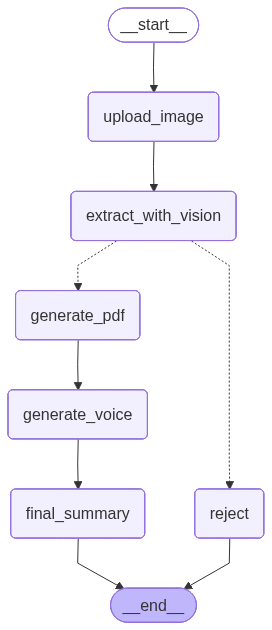
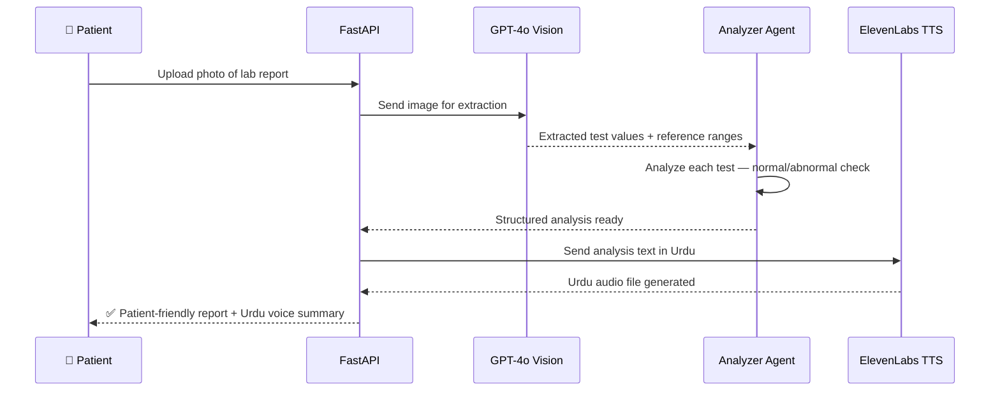

🧪 **AI Lab Report Analyzer — Vision-OCR + Urdu Voice Summary**

> **Production AI system** that photographs any lab test report and 
> instantly generates a complete patient-friendly analysis with 
> plain language explanations, normal/abnormal flagging, and 
> Urdu voice summary — deployed at Pakistan's largest digital 
> health platform.

---

## 📊 Production Impact

| Metric | Value |
|--------|-------|
| Patient support queries reduced | 35% |
| Languages supported | English + Urdu Voice |
| Report types handled | Blood tests, urine, thyroid, liver, kidney + more |
| Input method | Photo of printed lab report |
| Deployment | AWS · Docker · Production |

---

## 🏗️ LangGraph Pipeline Architecture

> **Smart conditional routing** — if the uploaded image cannot be 
> processed (poor quality or invalid document), the pipeline 
> gracefully rejects. On success: vision extraction → PDF 
> generation → Urdu voice → final summary.

---

## ⚡ Key Features

- **GPT-4o Vision extraction** — processes real-world lab report 
  photos handling lighting variation, angles, and print quality
- **Per-test analysis** — each individual test result analyzed 
  separately with plain language explanation
- **Normal/Abnormal flagging** — automatic detection with clear 
  health implication for the patient
- **Urdu voice summary** — ElevenLabs TTS generates audio 
  explanation in Urdu for low-literacy patients
- **End-to-end pipeline** — raw photo → structured analysis → 
  audio output in a single flow
- **No doctor appointment needed** — patients understand their 
  own results instantly

---

## 🔄 How It Works

---

## 🛠️ Tech Stack

| Layer | Technology |
|-------|-----------|
| Vision & Extraction | GPT-4o Vision |
| Agent Orchestration | LangChain |
| Voice Generation | ElevenLabs TTS |
| Backend | FastAPI, Python |
| PDF Processing | pdfplumber |
| Deployment | Docker, AWS |

---

## 📸 Live Demo

> Screenshots and demo coming soon

---

## 🎥 Demo Video

> Demo video coming soon

---

> ⚠️ **Note:** This repository showcases the architecture and design 
> of a production system built at Oladoc. Source code is proprietary.

---

## 📫 Contact

**Adnan Abdullah** — Agentic AI Engineer & AI Team Lead

---

*Built with GPT-4o Vision + ElevenLabs · Deployed at Pakistan's 
largest digital health platform · 35% reduction in patient 
support queries*
